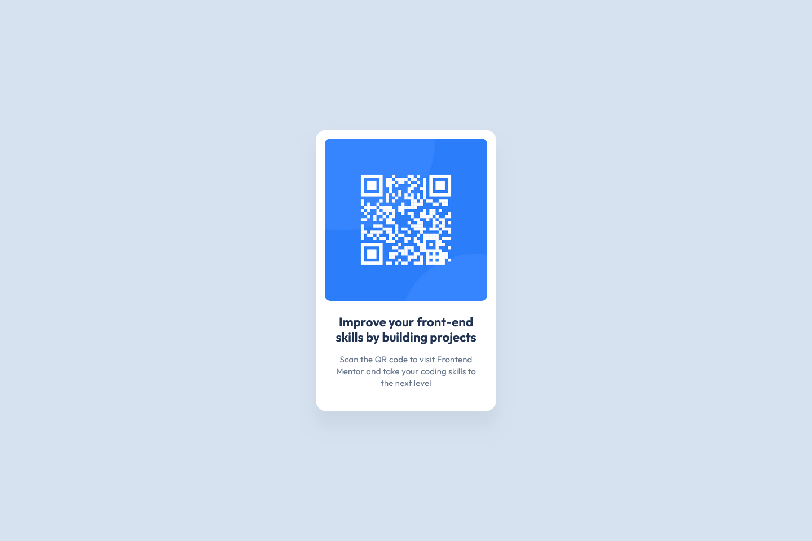

# Frontend Mentor - QR code component solution
This is a solution to the [QR code component challenge on Frontend Mentor](https://www.frontendmentor.io/challenges/qr-code-component-iux_sIO_H). Frontend Mentor challenges help you improve your coding skills by building realistic projects. 

## Screenshot

### Links
- Solution URL: [Github](https://your-solution-url.com)
- Live Site URL: [Github Pages](https://your-live-site-url.com)

## Author
- Github - [@RobertsPeirags](https://github.com/RobertsPeirags)
- Frontend Mentor - [@RobertsPeirags](https://frontendmentor.io/profile/RobertsPeirags)